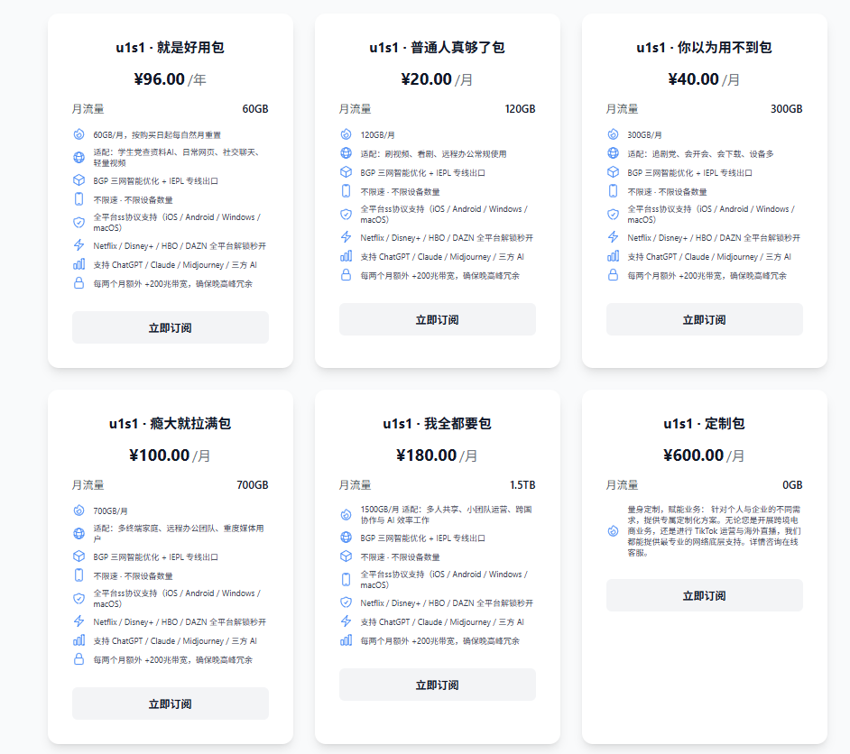

# 🏆 2026 最新稳定机场推荐 - 翻墙节点/流媒体解锁/专线加速指南

欢迎来到本项目！我们致力于提供全网最客观、最稳定的翻墙机场评测。本仓库整理了最新的稳定可靠的服务商，涵盖 IPLC/IEPL 专线、BGP 隧道中转以及纯原生 IP，满足您玩游戏、看 Netflix/Disney+ 4K 视频、学术查询等不同需求。

更多详情及动态测评，请访问我们的官方网站：[VpnsKnow-枫白网络机场](https://vpnsknow.com/)

---

## 📑 目录

1. [飞猫云 - 顶级IPLC专线游戏电竞节点](#1-飞猫云)
2. [一翻云 - 无视封锁全区流媒体解锁神器](#2-一翻云)
3. [唯兔云 - BGP千兆企业级大带宽接入](#3-唯兔云)
4. [闪电猫 - 晚高峰秒开Netflix高速机场](#4-闪电猫)
5. [光速云 - 极速稳定外贸跨境电商专用](#5-光速云)
6. [速界 - 原生IP抗封锁防关联首选](#6-速界)
7. [飞鸟云 - 超低延迟打外服电竞必备](#7-飞鸟云)
8. [星岛梦 - 高性价比看4K原画视频梯子](#8-星岛梦)
9. [光年梯 - 智能路由自动分流科学上网](#9-光年梯)
10. [奶昔云 - 老牌大厂安全隐私无日志保障](#10-奶昔云)
11. [sogo云 - 不限速全平台支持代理工具](#11-sogo云)
12. [二猫云 - 高端VLESS协议抗干扰强网](#12-二猫云)
13. [全球云 - 一键连接傻瓜式极速翻墙](#13-全球云)
14. [可信云 - 支持软路由器插件的高端线路](#14-可信云)
15. [宇宙云 - 秒解Disney+与Hulu海外专线](#15-宇宙云)
16. [edgenova边缘节点 - 高强度抗封锁防墙首选备用](#16-edgenova边缘节点)
17. [极连云 - 全节点解锁ChatGPT与AI工具](#17-极连云)
18. [U1S1 - 日韩台冷门流媒体原生解锁库](#18-u1s1)
19. [快狸 - 稳定零丢包海外企业级直连](#19-快狸)
20. [WgetCloud - 支持全协议订阅的高性价比入口](#20-wgetcloud)
21. [奈云 - 【⚠️ 该服务商已跑路，请勿购买】](#21-奈云)

---

## 1. 飞猫云 - 顶级IPLC专线游戏电竞节点

**评分:** ⭐ 9.9 / 10 &nbsp; | &nbsp; **起步价:** ¥25/月

**核心亮点:**
- 顶级 IPLC/IEPL 专线
- 全球骨干网穿透，晚高峰 0 丢包
- 游戏低延迟优化

### 💰 价格与套餐

| 套餐名称 | 周期 | 价格 | 推荐度 |
| :--- | :---: | :---: | :---: |
| 月付套餐 | 月 | ¥25 | ✅ 可选 |
| 半年套餐 | 半年 | ¥135 | ✅ 可选 |
| 年付优享 | 年 | ¥240 | 🔥 极力推荐 |

> **👉 [点击前往 飞猫云 官网查看详情](https://flycat1.flycatvipaff.cc/#/?code=2WjSgNW2)**

---

## 2. 一翻云 - 无视封锁全区流媒体解锁神器

**评分:** ⭐ 9.8 / 10 &nbsp; | &nbsp; **起步价:** ¥25/月

**核心亮点:**
- 极致流媒体解锁
- 自研 V-Ninja 混淆，无视深度包检测
- 客服秒回，保障在线

### 💰 价格与套餐

| 套餐名称 | 周期 | 价格 | 推荐度 |
| :--- | :---: | :---: | :---: |
| 月付体验版 | 月 | ¥25 | ✅ 可选 |
| 半年高能版 | 半年 | ¥137 | ✅ 可选 |
| 年度究极版 | 年 | ¥245 | 🔥 极力推荐 |

> **👉 [点击前往 一翻云 官网查看详情](https://wzjc.1flyunaff.cc/#/register?code=JSuuoEmO)**

---

## 3. 唯兔云 - BGP千兆企业级大带宽接入

**评分:** ⭐ 9.7 / 10 &nbsp; | &nbsp; **起步价:** ¥15/月

**核心亮点:**
- 极致流媒体解锁
- 企业级 BGP 入口，千兆专线直达
- 客服秒回，保障在线

### 💰 价格与套餐

| 套餐名称 | 周期 | 价格 | 推荐度 |
| :--- | :---: | :---: | :---: |
| 月付体验版 | 月 | ¥15 | ✅ 可选 |
| 半年高能版 | 半年 | ¥82 | ✅ 可选 |
| 年度究极版 | 年 | ¥147 | 🔥 极力推荐 |

> **👉 [点击前往 唯兔云 官网查看详情](https://fast.v2yunvipaff.com/#/?code=FGETH51Z)**

---

## 4. 闪电猫 - 晚高峰秒开Netflix高速机场

**评分:** ⭐ 9.6 / 10 &nbsp; | &nbsp; **起步价:** ¥28/月

**核心亮点:**
- Netflix/动画疯全解
- 动态 IP 轮换池，解锁严苛锁区
- 独家自研隧道加密

### 💰 价格与套餐

| 套餐名称 | 周期 | 价格 | 推荐度 |
| :--- | :---: | :---: | :---: |
| 月付体验版 | 月 | ¥28 | ✅ 可选 |
| 半年高能版 | 半年 | ¥154 | ✅ 可选 |
| 年度究极版 | 年 | ¥274 | 🔥 极力推荐 |

> **👉 [点击前往 闪电猫 官网查看详情](https://speedcat.com/#/register?code=SpeedCatAff)**

---

## 5. 光速云 - 极速稳定外贸跨境电商专用

**评分:** ⭐ 9.5 / 10 &nbsp; | &nbsp; **起步价:** ¥17/月

**核心亮点:**
- Netflix/动画疯全解
- 微秒级路由优化，PVP 游戏首选
- 全平台客户端支持

### 💰 价格与套餐

| 套餐名称 | 周期 | 价格 | 推荐度 |
| :--- | :---: | :---: | :---: |
| 月付体验版 | 月 | ¥17 | ✅ 可选 |
| 半年高能版 | 半年 | ¥93 | ✅ 可选 |
| 年度究极版 | 年 | ¥166 | 🔥 极力推荐 |

> **👉 [点击前往 光速云 官网查看详情](https://mdlky.gsyaff.com/#/?code=lQiSJled)**

---

## 6. 速界 - 原生IP抗封锁防关联首选

**评分:** ⭐ 9.4 / 10 &nbsp; | &nbsp; **起步价:** ¥25/月

**核心亮点:**
- 性价比极高
- UDP 全链路转发，完美支持主机联机
- 独家自研隧道加密

### 💰 价格与套餐

| 套餐名称 | 周期 | 价格 | 推荐度 |
| :--- | :---: | :---: | :---: |
| 月付体验版 | 月 | ¥25 | ✅ 可选 |
| 半年高能版 | 半年 | ¥137 | ✅ 可选 |
| 年度究极版 | 年 | ¥245 | 🔥 极力推荐 |

> **👉 [点击前往 速界 官网查看详情](https://work.speedworldaff.cc/#/register?code=3jebW7BH)**

---

## 7. 飞鸟云 - 超低延迟打外服电竞必备

**评分:** ⭐ 9.3 / 10 &nbsp; | &nbsp; **起步价:** ¥20/月

**核心亮点:**
- 高匿名无日志记录
- 双轨 IPLC 物理专线，拔线级抗封锁
- 多开设备不限制

### 💰 价格与套餐

| 套餐名称 | 周期 | 价格 | 推荐度 |
| :--- | :---: | :---: | :---: |
| 月付体验版 | 月 | ¥20 | ✅ 可选 |
| 半年高能版 | 半年 | ¥110 | ✅ 可选 |
| 年度究极版 | 年 | ¥196 | 🔥 极力推荐 |

> **👉 [点击前往 飞鸟云 官网查看详情](https://feiniaoyun.com/#/register?code=FeiNiaoAff)**

---

## 8. 星岛梦 - 高性价比看4K原画视频梯子

**评分:** ⭐ 9.2 / 10 &nbsp; | &nbsp; **起步价:** ¥25/月

**核心亮点:**
- 性价比极高
- 新加坡原生商宽，流媒体秒切 4K
- 独家自研隧道加密

### 💰 价格与套餐

| 套餐名称 | 周期 | 价格 | 推荐度 |
| :--- | :---: | :---: | :---: |
| 月付体验版 | 月 | ¥25 | ✅ 可选 |
| 半年高能版 | 半年 | ¥137 | ✅ 可选 |
| 年度究极版 | 年 | ¥245 | 🔥 极力推荐 |

> **👉 [点击前往 星岛梦 官网查看详情](https://kfccbb.xingdaomeng.com/#/?code=DATAHVHs)**

---

## 9. 光年梯 - 智能路由自动分流科学上网

**评分:** ⭐ 9.1 / 10 &nbsp; | &nbsp; **起步价:** ¥18/月

**核心亮点:**
- Netflix/动画疯全解
- 量子抗性加密隧道，隐私绝对隔离
- 全平台客户端支持

### 💰 价格与套餐

| 套餐名称 | 周期 | 价格 | 推荐度 |
| :--- | :---: | :---: | :---: |
| 月付体验版 | 月 | ¥18 | ✅ 可选 |
| 半年高能版 | 半年 | ¥99 | ✅ 可选 |
| 年度究极版 | 年 | ¥176 | 🔥 极力推荐 |

> **👉 [点击前往 光年梯 官网查看详情](https://ggmq.gntaff.com/#/?code=TD4zCE4v)**

---

## 10. 奶昔云 - 老牌大厂安全隐私无日志保障

**评分:** ⭐ 9 / 10 &nbsp; | &nbsp; **起步价:** ¥42/月

**核心亮点:**
- 性价比极高
- 智能 Qos 突破，全天候满血并发
- 全平台客户端支持

### 💰 价格与套餐

| 套餐名称 | 周期 | 价格 | 推荐度 |
| :--- | :---: | :---: | :---: |
| 月付体验版 | 月 | ¥42 | ✅ 可选 |
| 半年高能版 | 半年 | ¥231 | ✅ 可选 |
| 年度究极版 | 年 | ¥411 | 🔥 极力推荐 |

> **👉 [点击前往 奶昔云 官网查看详情](https://nexitally.com/#/register?code=NexitallyAff)**

---

## 11. sogo云 - 不限速全平台支持代理工具

**评分:** ⭐ 8.9 / 10 &nbsp; | &nbsp; **起步价:** ¥15/月

**核心亮点:**
- 性价比极高
- 无日志 RAM 节点，重启即销毁数据
- 独家自研隧道加密

### 💰 价格与套餐

| 套餐名称 | 周期 | 价格 | 推荐度 |
| :--- | :---: | :---: | :---: |
| 月付体验版 | 月 | ¥15 | ✅ 可选 |
| 半年高能版 | 半年 | ¥82 | ✅ 可选 |
| 年度究极版 | 年 | ¥147 | 🔥 极力推荐 |

> **👉 [点击前往 sogo云 官网查看详情](https://wzjc.sogoyunaff.cc/#/login?code=N0LVqhOL)**

---

## 12. 二猫云 - 高端VLESS协议抗干扰强网

**评分:** ⭐ 8.8 / 10 &nbsp; | &nbsp; **起步价:** ¥20/月

**核心亮点:**
- Netflix/动画疯全解
- 自动负载均衡阵列，单点故障秒切
- 全平台客户端支持

### 💰 价格与套餐

| 套餐名称 | 周期 | 价格 | 推荐度 |
| :--- | :---: | :---: | :---: |
| 月付体验版 | 月 | ¥20 | ✅ 可选 |
| 半年高能版 | 半年 | ¥110 | ✅ 可选 |
| 年度究极版 | 年 | ¥196 | 🔥 极力推荐 |

> **👉 [点击前往 二猫云 官网查看详情](https://wzjc.2maoyunaff.cc/#/register?code=GsaOg5Lk)**

---

## 13. 全球云 - 一键连接傻瓜式极速翻墙

**评分:** ⭐ 8.7 / 10 &nbsp; | &nbsp; **起步价:** ¥20/月

**核心亮点:**
- 性价比极高
- 去中心化出口拓扑，防御反向溯源
- 独家自研隧道加密

### 💰 价格与套餐

| 套餐名称 | 周期 | 价格 | 推荐度 |
| :--- | :---: | :---: | :---: |
| 月付体验版 | 月 | ¥20 | ✅ 可选 |
| 半年高能版 | 半年 | ¥110 | ✅ 可选 |
| 年度究极版 | 年 | ¥196 | 🔥 极力推荐 |

> **👉 [点击前往 全球云 官网查看详情](https://sswdh.gcvipaff.com/#/?code=ptPZMzHO)**

---

## 14. 可信云 - 支持软路由器插件的高端线路

**评分:** ⭐ 8.6 / 10 &nbsp; | &nbsp; **起步价:** ¥25/月

**核心亮点:**
- Netflix/动画疯全解
- 深网级高纯度节点池，抗审查 MAX
- 全平台客户端支持

### 💰 价格与套餐

| 套餐名称 | 周期 | 价格 | 推荐度 |
| :--- | :---: | :---: | :---: |
| 月付体验版 | 月 | ¥25 | ✅ 可选 |
| 半年高能版 | 半年 | ¥137 | ✅ 可选 |
| 年度究极版 | 年 | ¥245 | 🔥 极力推荐 |

> **👉 [点击前往 可信云 官网查看详情](https://work.kosingaff.com/#/register?code=6PqaK0c5)**

---

## 15. 宇宙云 - 秒解Disney+与Hulu海外专线

**评分:** ⭐ 8.5 / 10 &nbsp; | &nbsp; **起步价:** ¥12.5/月

**核心亮点:**
- 顶级 IPLC/IEPL 专线
- 全网段 IPv6 支持，规避常规墙拦截
- 游戏低延迟优化

### 💰 价格与套餐

| 套餐名称 | 周期 | 价格 | 推荐度 |
| :--- | :---: | :---: | :---: |
| 月付体验版 | 月 | ¥12 | ✅ 可选 |
| 半年高能版 | 半年 | ¥66 | ✅ 可选 |
| 年度究极版 | 年 | ¥117 | 🔥 极力推荐 |

> **👉 [点击前往 宇宙云 官网查看详情](https://wzjc.yuzoucloud.cc/#/register?code=wosXpe6G)**

---

## 16. edgenova边缘节点 - 高强度抗封锁防墙首选备用

**评分:** ⭐ 8.4 / 10 &nbsp; | &nbsp; **起步价:** ¥25/月

**核心亮点:**
- 极致流媒体解锁
- 边缘节点算力加持，极速加密握手
- 客服秒回，保障在线

### 💰 价格与套餐

| 套餐名称 | 周期 | 价格 | 推荐度 |
| :--- | :---: | :---: | :---: |
| 月付体验版 | 月 | ¥25 | ✅ 可选 |
| 半年高能版 | 半年 | ¥137 | ✅ 可选 |
| 年度究极版 | 年 | ¥245 | 🔥 极力推荐 |

> **👉 [点击前往 edgenova边缘节点 官网查看详情](https://work.edgenovaaff.cc/#/register?code=OACbYE7B)**

---

## 17. 极连云 - 全节点解锁ChatGPT与AI工具

**评分:** ⭐ 8.3 / 10 &nbsp; | &nbsp; **起步价:** ¥18/月

**核心亮点:**
- 顶级 IPLC/IEPL 专线
- 全系真实住宅 IP，解锁 AI 服务绝佳
- 游戏低延迟优化

### 💰 价格与套餐

| 套餐名称 | 周期 | 价格 | 推荐度 |
| :--- | :---: | :---: | :---: |
| 月付体验版 | 月 | ¥18 | ✅ 可选 |
| 半年高能版 | 半年 | ¥99 | ✅ 可选 |
| 年度究极版 | 年 | ¥176 | 🔥 极力推荐 |

> **👉 [点击前往 极连云 官网查看详情](https://kdjhao.jlyvipaff.com/#/?code=iVjSy3ku)**

---

## 18. U1S1 - 日韩台冷门流媒体原生解锁库

**评分:** ⭐ 8.2 / 10 &nbsp; | &nbsp; **起步价:** ¥8/月

**核心亮点:**
- 极致流媒体解锁
- 多路复用 Multiplex，并发请求无瓶颈
- 客服秒回，保障在线

### 💰 价格与套餐

| 套餐名称 | 周期 | 价格 | 推荐度 |
| :--- | :---: | :---: | :---: |
| 体验月付 | 月 | ¥8 | ✅ 可选 |
| 季度畅享 | 季 | ¥22 | ✅ 可选 |
| 年度VIP | 年 | ¥80 | 🔥 极力推荐 |

> **👉 [点击前往 U1S1 官网查看详情](https://pkdj7.vipaff.cc/#/?code=gm8PBddk)**

---

## 19. 快狸 - 稳定零丢包海外企业级直连

**评分:** ⭐ 8.1 / 10 &nbsp; | &nbsp; **起步价:** ¥25/月

**核心亮点:**
- 顶级 IPLC/IEPL 专线
- 底层内核态转发，设备发热降至极限
- 游戏低延迟优化

### 💰 价格与套餐

| 套餐名称 | 周期 | 价格 | 推荐度 |
| :--- | :---: | :---: | :---: |
| 月付体验版 | 月 | ¥25 | ✅ 可选 |
| 半年高能版 | 半年 | ¥137 | ✅ 可选 |
| 年度究极版 | 年 | ¥245 | 🔥 极力推荐 |

> **👉 [点击前往 快狸 官网查看详情](https://work.kuailicloud.cc/#/register?code=oWy2AO9F)**

---

## 20. WgetCloud - 支持全协议订阅的高性价比入口

**评分:** ⭐ 8 / 10 &nbsp; | &nbsp; **起步价:** ¥39/月

**核心亮点:**
- 独家自研隧道加密
- 全天候探针监控，网络断点毫秒自愈
- 多开设备不限制

### 💰 价格与套餐

| 套餐名称 | 周期 | 价格 | 推荐度 |
| :--- | :---: | :---: | :---: |
| 月付体验版 | 月 | ¥39 | ✅ 可选 |
| 半年高能版 | 半年 | ¥214 | ✅ 可选 |
| 年度究极版 | 年 | ¥382 | 🔥 极力推荐 |

> **👉 [点击前往 WgetCloud 官网查看详情](https://wgetcloud.com/#/register?code=WgetCloudAff)**

---

## 21. 奈云 - 【⚠️ 该服务商已跑路，请勿购买】

> [!WARNING]
> **风险提示：** 经过我们及社区用户的最新反馈，该机场服务商疑似资金链断裂或已跑路，目前节点处于大面积瘫痪状态。为了您的资产安全，我们已紧急下架其官网注册通道。

**评分:** ⭐ 2 / 10 &nbsp; | &nbsp; **起步价:** ¥22/月

**核心亮点:**
- 性价比极高
- 极简跨平台底层架构，光速部署接入
- 全节点晚高峰 4K 秒开

### 💰 价格与套餐

| 套餐名称 | 周期 | 价格 | 推荐度 |
| :--- | :---: | :---: | :---: |
| 月付体验版 | 月 | ¥22 | ✅ 可选 |
| 半年高能版 | 半年 | ¥121 | ✅ 可选 |
| 年度究极版 | 年 | ¥215 | 🔥 极力推荐 |

---

## 💡 科学上网与流媒体 FAQ 常见问题解答

为了帮助初学者更好地理解科学上网的底层逻辑与防坑指南，我们整理了以下常见问题：

### 新手该看什么？如何快速入门？
新手入门最核心的三个步骤：1. 购买一个可靠的专线机场（获取节点订阅链接）；2. 下载对应设备（Windows/Mac/iOS/Android）的代理客户端；3. 将订阅链接导入客户端并开启代理。在这个过程中，建议不要盲目追求免费节点，因为免费节点通常极度不稳定且存在隐私风险。直接选择我们的推荐榜单前三名，可以为您节省 90% 的折腾时间。

### 机场和传统 VPN 有什么区别？
传统 VPN 通常是一个封闭的软件，安装后一键连接，虽然简单，但节点容易被封锁，且协议陈旧（如 OpenVPN、IPsec），速度慢，价格高昂。而“机场”是提供节点订阅的服务商，他们使用更隐蔽、更高效的开源协议（如 Vless、Shadowsocks），你需要配合第三方客户端（如 Clash、Shadowrocket）使用。机场通常拥有更多的全球节点、更快的解锁速度（如 Netflix 4K）、更低的价格，以及极其灵活的分流规则（国内直连，国外走代理）。

### 科学上网是什么意思？
科学上网是大陆网民对绕过网络审查（突破 GFW 防火长城）访问国际互联网资源的一种委婉称呼。通过使用加密代理协议，用户可以自由访问 Google、YouTube、Twitter、GitHub 等被屏蔽的网站。随着技术的发展，目前的科学上网不仅是为了看网页，更多是为了高清流媒体解锁、AI 工具使用和跨境办公。

### AI 上网有什么特殊要求吗？
是的！以 ChatGPT (OpenAI)、Claude、Gemini 为代表的 AI 服务对 IP 的风控极其严格。普通的 VPS 自建节点或劣质机场的 IP 往往属于“万人骑”的数据中心（Hosting）IP，极易被 OpenAI 封号或拒绝访问（Access Denied）。要实现无障碍的 AI 上网，你需要使用拥有高质量原生 IP（ISP 住宅 IP）的机场节点。我们的榜单中会特别标注具有 AI 解锁能力的机场。

### 除了翻墙，机场还有什么用处？
机场的核心价值远不止于访问 Google。它的巨大用处包括：
1. **流媒体解锁**：观看 Netflix、Disney+、HBO、Hulu、AbemaTV 等拥有严格地区版权限制的影视平台。
2. **AI 工具生产力**：无缝使用 ChatGPT、Midjourney 等不对大陆开放的前沿 AI。
3. **跨境电商与外贸**：运营 TikTok 矩阵、访问亚马逊卖家后台，需要极高纯净度的原生 IP 环境。
4. **学术与开发**：留学生访问海外知网、程序员无障碍使用 GitHub Copilot 及查阅技术文档。
5. **游戏加速**：通过极低延迟的专线节点（如 IPLC/IEPL）连接外服游戏（如 Valorant、Apex）。

### 什么是全局模式、规则模式和直连模式？
这是代理客户端最核心的三个路由设置：
- **规则模式 (Rule)**：最常用的智能模式。国内网站（如淘宝、百度）不走代理，海外被墙网站（如 Google）走代理，省流量且速度快。
- **全局模式 (Global)**：强制你电脑里所有的流量都经过海外节点。当某些小众海外网站没在规则库里、打不开时，可以临时切成全局模式。
- **直连模式 (Direct)**：关闭代理，所有流量均走你本地的宽带，等于没开翻墙软件。

### 什么是 TUN 虚拟网卡模式？为什么 PC 游戏必须开它？
普通的代理模式（System Proxy）只能代理浏览器的 HTTP 流量。但很多 PC 游戏（如 Steam 联机）、命令行工具和老旧软件不会走系统代理设置。**TUN 模式**会在你的系统底层虚拟出一张网卡，强制接管所有底层流量（包括 TCP 和 UDP），让这台电脑上所有的软件都像真正身处海外一样联网，是终极的代理接管方案。

### 电脑开启代理后，微软商店 (UWP应用) 连不上网？
这是 Windows 10/11 的安全机制导致的。UWP 应用被运行在系统沙盒中，默认被禁止访问本地回环地址（Localhost），也就是无法连接到你的代理软件本地端口。解决方法：在 Clash 等客户端的设置里找到 `UWP Loopback`（UWP 局域网环回解除工具），勾选所有应用并保存即可。

### 为什么测速软件能跑 500M，但我看网页却感觉很卡？
测速软件（如 Speedtest）主要测试的是**持续大文件下载的峰值带宽**。但网页浏览包含了加载几百个小图片、JS 脚本的“高频并发请求”。如果你的节点**延迟（Ping）高**或**丢包率大**，即使带宽很大，网页也会加载得非常缓慢。网页体验看重的是低延迟和无丢包，这就是为什么 50M 的 IPLC 专线刷网页比 1000M 的普通节点还要丝滑的原因。

### IEPL 是什么？和 IPLC 有什么区别？
IEPL（国际以太网专线）和 IPLC（国际私有租用线路）都是顶级机场用来实现“端到端内网传输”的物理专线。它们不经过公网 GFW，因此**完全无视防火墙封锁，且晚高峰绝对不卡、延迟极低**。
- **IPLC** 是基于传统底层传输的技术。
- **IEPL** 是基于以太网协议的专线，部署更灵活，是目前中高端机场的主流方案。看到标有“IEPL”的节点，通常意味着价格较贵但体验极其丝滑。

### Vless 协议是什么？为什么现在很火？
VLESS 是一种无状态的轻量级代理协议，它是 V2Ray (Xray) 生态的一部分。相比于老旧的 Shadowsocks 或 Vmess，VLESS 剥离了复杂的加密算法，将加密交给了底层的 TLS。尤其是当 VLESS 结合 Reality 技术（VLESS+Reality）时，它可以完美伪装成访问普通海外网站的流量，具有极其强大的“抗封锁”能力。每当敏感时期普通节点大面积阵亡时，VLESS 节点往往坚如磐石。

### 节点流量是怎么计算的？倍率是什么意思？
流量倍率是指你消耗 1GB 实际流量，在机场后台会扣除多少流量。例如，如果你使用了“1.5倍率”的香港节点下载了 1GB 的文件，你的机场总流量将被扣除 1.5GB。通常情况下：
- 普通中转节点倍率是 1.0 或 0.5。
- 昂贵的 IPLC/IEPL 专线节点倍率可能是 1.5 到 3.0，甚至更高（因为专线带宽成本极高）。
在看视频下载大文件时，建议切回 1.0 倍率节点；打游戏或需要极致响应时，再用高倍率专线。

> **了解更多硬核网络知识与测速评测，请访问：[VpnsKnow-枫白网络机场](https://vpnsknow.com/wiki)**

## ⚠️ 免责声明
本项目提供的信息仅供学习和学术研究参考，请严格遵守当地法律法规。

